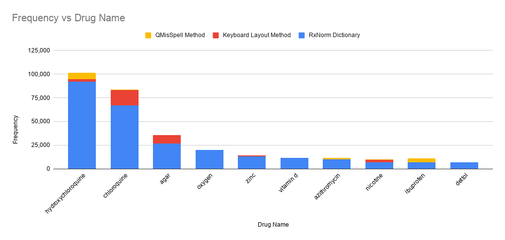

# Abstract

Since the classification of COVID-19 as a global pandemic, there have been many attempts to treat and contain the virus. Although there is no specific antiviral treatment recommended for COVID-19, there are several drugs that can potentially help with symptoms. In this work, we mined a large twitter dataset of 280 million tweets of COVID-19 chatter to identify discourse around potential treatments. While seemingly a straightforward task, due to the informal nature of language use in Twitter, we demonstrate the need of machine learning methods to aid in this task. By applying these methods we are able to recover almost 21% additional data than with traditional methods.

# Introduction 

The World Health Organization (WHO) defines the Coronavirus disease (COVID-19) as an infectious disease caused by a newly discovered coronavirus and declared it a pandemic on March 11, 2020 [@WorldHealthOrganization]. As of May 11, 2020, 4,148,034 cases were confirmed worldwide with 284,124 deaths and 1,428,161 cases recovered. Social media platforms like Twitter and Reddit contain an abundance of text data that can be utilized for research. Over the last decade, Twitter has proven to be a valuable resource during disasters for many-to-many crisis communication [@Earle:2010] [@Zou:2018] [@Alam:2018]. Recently, Several works [@Gao:2020] [@Lu:2020] [@Sanders:2020]  have provided insights on the treatment options and drug usages for COVID-19. 

We utilized the largest available COVID-19 dataset [@Banda:2020] curated using a Social Media Mining Toolkit [@Tekumalla:2020]. This dataset consists of tweets related to COVID-19 from January 1, 2020. Version 9 was utilized for our experiments since it was the latest version at the time of experiments. We annotated ~283 million tweets using the drug dictionary [@Tekumalla:2019] compiled from RxNorm [@NationalLibraryofMedicine:2008] with 19,643 terms and validated in [@Tekumalla:2019] and [@TekumallaandBanda:2020]. 

# Methods

In order to identify drug-specific tweets related to COVID-19, we applied the drug dictionary on the clean version of the dataset. With the presence of retweets, any signal found would be greatly amplified and hence only unique tweets must be utilized to identify the signals. The cleaned version of the dataset consists of 62 million unique tweets with no retweets. The Spacy annotator utility from the Social Media Mining Toolkit [@Tekumalla:2020] was utilized to annotate the clean tweets. A total of 677,729 tweets were identified as tweets containing one or more drug terms in them. However, complex medical terms, such as medication and disease names, are often misspelled by users on Twitter [@Karimi:2015]. Using only the keywords with correct spellings leads to a loss of potentially important data, particularly for terms with difficult spellings. Some misspellings also occur more frequently than others, implying that they are more important for data collection and concept detection. To determine the misspelled drug tweets, we initially identified the top 200 drug terms from 677,729 drug tweets from the clean dataset to generate misspellings. 

We employed two different methodologies, a machine learning approach called QMisSpell [@Sarker:2018] and a more traditional approach of generating misspellings using keyboard layout distance. The RedMed [@Lavertu:2019] model’s word embeddings was utilized in QMisSpell to generate misspellings. QMisSpell relies on a dense vector model learned from large, unlabeled text, which identifies semantically close terms to the original keyword, followed by the filtering of terms that are lexically dissimilar beyond a given threshold. The process is recursive and converges when no new terms similar (lexically and semantically) to the original keyword are found. A total of 2,056 unique misspelled terms were generated using QMisSpell. We examined all the misspellings and eliminated several terms (example: heroes, heroine generated from the original keyword heroin) which are common terms in English vocabulary and are not misspellings of drug terms. Post elimination, a total of 1,908 terms are identified as the misspelt terms.

The second methodology utilizes keyboard layout distance for generating the misspellings. For each term, each alphabet is replaced with the closest alphabet on the QWERTY keyboard. This process is recursive and ceases when it has looped through every alphabet in the term. For example, the term cocaine has 68 misspelled terms which vary from xocaine to cocaint. After eliminating the common vocabulary and duplicates, a total of 15,696 terms are identified as misspelled terms for this methodology. We annotated the clean dataset utilizing the misspelled terms from the methodologies. Table 1 summarizes the results. Overlap between QMisSpell and the Keyboard Layout generator is 4.9%. 33 terms were common between the two misspelled dictionaries.

Table 1. Term annotation results

| Dictionary | Total number of terms |Total annotated terms |
| -------- | -------- | -------- |
| RxNorm drug Dictionary | 19,643 | 768,752 |
| QMisSpell | 1,908 | 97,776 |
| Keyboard Layout Method | 15,696 | 76,394 |
| Total | 37,214 | 942,922 |

Table 2. Most frequent drugs found using the drug dictionary.

| Drug Name | Frequency |
| -------- | -------- | 
| hydroxychloroquine | 91,696 |
| chloroquine | 66,904 |
| agar | 26,748 |
| oxygen | 20,214 |
| zinc | 13,235 |
| vitamin d | 11,770 |
| azithromycin | 9,992 |
| nicotine | 7,140 |
| ibuprofen | 6,804 |
| dettol | 6,779 |

# Results

Not unexpectedly, Hydroxychloroquine was the most tweeted drug found on the dataset with chloroquine coming in as close second, as shown on Table 2. Interestingly enough, hydroxychloroquine was not the most misspelled word, chloroquine was, as we can see on Table 3.

Table 3. Most frequent misspelled drugs found using the two methods

| Keyboard Layout Method Drug Name | Keyboard Layout Method Frequency | QMisSpell Method Drug Name | QMisSpell Method Frequency  |
| -------- | -------- | -------- | -------- | 
| chloroquine | 16,361 | hydroxychloroquine | 6,650 |
| vitamin a | 12,094 | allegra | 6,266 |
| agar | 8,933 | meted | 5,135 |
| hydroxychloroquine | 2,878 | ibuprofen | 4,249 |
| doral | 2,445 | propane | 4,233 |
| nicotine | 2,445 | coconut oil | 2,228 |
| cocaine | 900 | azithromycin | 1,624 |
| zinc | 858 | acetaminophen | 726 |
| septa | 538 | aluminum | 672 |
| aleve | 487 | chlorine | 555 |

In our exploration of misspellings, we had 23 potential different spellings for Hydroxychloroquine. We have 78 possible misspellings from chloroquine as well. While not all possible misspellings are found in the actual Twitter data, a good combination of them (45%) are actually present, indicating how tricky it is to work with Twitter text data. The total added term counts can be found in Figure 1. As we can see in both Figure 1 and Table 1, by considering the possibility of misspellings, we find around 20% more data. When dealing with limited text availability, particularly drug terms in Twitter, it is vital to use these types of methods to recover as much signal as we can. Terms such as Agar, Coconut Oil and Zinc acquired high counts as listed on Table 3. This is due to a few irrelevant terms prevailing in the dictionary. The drug dictionary curated from RxNorm consists of terms from different semantic types (Ingredients, Semantic Clinical Drug Component, Semantic Branded Drug Component and Semantic Branded Drug). The Ingredients semantic type consists of different terms that are technically not drugs but are utilized in creating drugs (Eg: Gelatin, Agar, Coconut Oil, Zinc). Such terms were still included in the dictionary due to the granularity they bring to the research. 

Figure 1. Drug Term occurrences during COVID-19

# Future Work

In this research, we generated misspellings utilizing two different methods. While the keyboard layout method is an automated method to generate misspellings, the QMisSpell method generates misspellings based on language models. Unfortunately, not many  pre-trained models related to drug research are readily available. The language model used in this research was able to generate misspellings for 80% of the top 200 terms. It is immensely difficult to obtain drug related data to create a language model to generate misspellings for all terms due to unavailability of the data. In future, we would like to implement an auto correct module, which would rectify the misspellings at the text level. This would potentially demonstrate the trade off between generating misspellings vs auto correcting the spellings at the text level. 

# Conclusion

This research utilized the largest available COVID-19 dataset to identify the drugs that circumscribe around coronavirus. By employing two different spelling modules, we were able to recover 21% additional data which can be utilized for research. Using sentiment analysis, we can also identify how users respond to these drugs and identify the drugs that help with some symptoms. With plenty of careful research, this data can be utilized for extracting treatment options. 

# GitHub repository

* Link to the github repository - https://github.com/thepanacealab/covid19_biohackathon/tree/master/treatments_misinformation

# Acknowledgements

This research was developed during COVID-19 Biohackathon April 5-11 2020. We thank the organizers for coordinating the virtual hackathon during the COVID-19 crisis. 

# References

